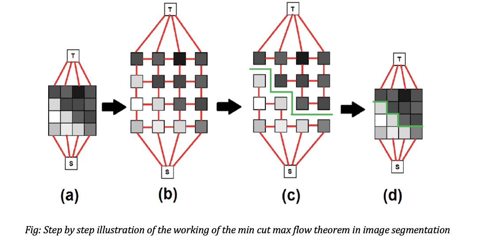
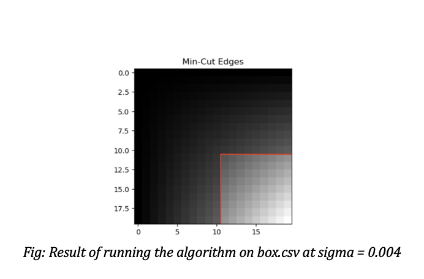
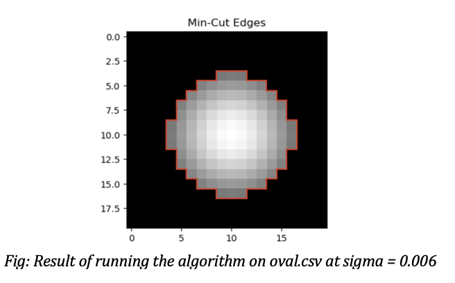
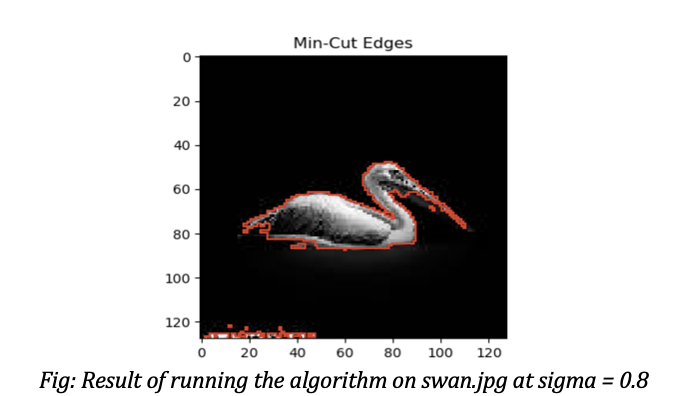

# Image Segmentation using Minimum Cut - Maximum Flow

## Introduction

Image segmentation is a crucial task in image processing with diverse applications including medical imaging, autonomous vehicles, and object detection. Traditional segmentation methods struggle with complex or noisy greyscale images, leading us to adopt a graph-based optimization technique leveraging the **Max Flow/Min Cut theorem**. Our approach represents an image as a flow network, with pixels as nodes and similarity between neighboring pixels as weighted edges.

---

## Project Goals

We aim to develop an advanced image segmentation tool that accurately separates foreground from background by modeling an image as a network graph and applying optimization techniques to identify the minimal cut. In our startup's initiative to develop a cutting-edge image segmentation tool to compete with established software like Photoshop, we face the challenge of effectively distinguishing between the foreground and background elements of an image. Image segmentation is a crucial task in computer vision that involves partitioning an image into meaningful segments, allowing for easier analysis and manipulation of the image. The goal is to create a system that accurately identifies and separates these segments based on pixel intensity values.

We must first consider how to represent an image as a network. For instance, a typical image can be viewed as a grid of pixel values, such as a 20x20 pixel image containing 400 pixels. Each pixel will be treated as a node in a graph, where the edge (i, j) reflects the similarity between pixel (i) and pixel (j). This graph primarily focuses on neighboring pixels, meaning that only direct connections (e.g., above, below, left and right) will be considered, while non-neighboring pixels will not have direct connections. The similarity between pixels is calculated using an exponential function based on the difference in their intensity values, allowing us to quantify how closely related or connected they are.

In addition to representing pixels as nodes, we introduce two terminal nodes: a source node connected solely to a designated background pixel and a sink node connected only to a chosen foreground pixel. This structure dictates the flow of information between the source and sink, facilitating the separation of the image into distinct regions. Our goal is to:

- Represent images as graphs where pixels are nodes.
- Utilize the Max Flow/Min Cut theorem to segment images efficiently.
- Achieve high accuracy, particularly for noisy and complex images.

---

## Methodology

### Graph Representation
- Pixels are nodes in a graph.
- Edges represent similarity between adjacent pixels using an exponential similarity measure:

$$\[\text{Similarity}(i,j) = e^{-\frac{(I_i - I_j)^2}{\sigma^2}}\]$$

- Introduce source (background) and sink (foreground) nodes for the optimization.

### Minimum Cut - Maximum Flow Approach
The Max Flow/Min Cut Theorem is a key concept in network flow theory that plays a significant role in image segmentation tasks. In this context, an image is modeled as a grid of pixel intensities, where each pixel is represented as a node in a flow network. The connections between these nodes signify the similarities between neighboring pixels, calculated by a similarity measure based on pixel intensities. The objective is to separate the image into distinct regions, typically isolating the foreground object from the background. By utilizing this theorem, we can effectively model the segmentation problem as a flow network, where a source node represents a background pixel and a sink node corresponds to a foreground pixel.

This theorem states that the maximum flow from the source node to the sink node is equal to the minimum cut required to block all flow from the source to the sink. In the image segmentation scenario, maximizing the flow indicates identifying the strongest connections (or similarities) between pixels that contribute to the segmentation of the foreground from the background. Once the maximum flow is established, the residual network is analyzed to identify the minimum cut, which highlights the connections that, when severed, would isolate the foreground from the background. This relationship is critical for determining the optimal cut needed to achieve accurate segmentation.

Some benefits of using this in image segmentation include computational efficiency and enhanced accuracy by converting the segmentation task into a linear programming problem. This method's ability to accurately distinguish between closely related pixel values allows for precise segmentation results, ultimately contributing to the development of a high-quality image segmentation tool for our startup that can compete effectively in the market.

- Apply the Max Flow/Min Cut theorem to identify the strongest connections contributing to segmentation.
- Maximize flow from source to sink, then find the minimal cut to separate foreground and background.

---

---

## Implementation Overview

### Steps in the Algorithm
1. **Data Loading:** Handles `.csv` and `.jpg` files, converting images into intensity matrices.
2. **Graph Creation:** Constructs pixel similarity network and defines source/sink nodes.
3. **Max Flow Optimization:** Uses the Gurobi optimizer to calculate maximum flow.
4. **Residual Network Construction:** Builds the residual network from optimization results.
5. **Accessible Nodes and Min-Cut Edges:** Performs depth-first search to identify segmentation edges.
6. **Visualization:** Displays segmentation with cuts highlighted.

---

## Results

Our algorithm successfully segmented provided datasets:

- **Box.csv (sigma = 0.004):** Clearly separated foreground from background.
- **Oval.csv (sigma = 0.006):** Effectively isolated the oval shape.
- **Swan.jpg (sigma = 0.8):** Successfully segmented complex greyscale image of a swan.

Tests with other grayscale images from the web also showed accurate segmentation capabilities.

---

## Conclusion and Future Work

Our method effectively segments grayscale images using graph-based optimization. Key insights:

- Results depend significantly on the chosen sigma value.
- Processing speed varies with image size.

### Future Enhancements
- Automatic sigma value selection.
- Improved scalability for larger images.
- Extension to color images for broader application.

---

## References
- [ResearchGate - Max Flow Min Cut Approach](https://www.researchgate.net/figure/Using-the-max-flow-min-cut-approach-for-image-segmentation-a-Define-set-of-pixels-in_fig5_292335453)
- [Julie Jiang - Image Segmentation](https://julie-jiang.github.io/image-segmentation/)
- [AI Explained - Image Segmentation](https://www.youtube.com/watch?v=Tl90tNtKvxs)
- [AI University - Image Segmentation using Max Flow Min Cut](https://www.youtube.com/watch?v=7fujbpJ0LB4&t=372s)
- OpenAI’s ChatGPT suggestions integrated for optimization and logical structuring.

 
pandoc Optimization - Image Segmentation.docx -o output.md